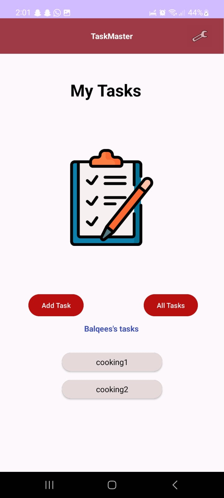
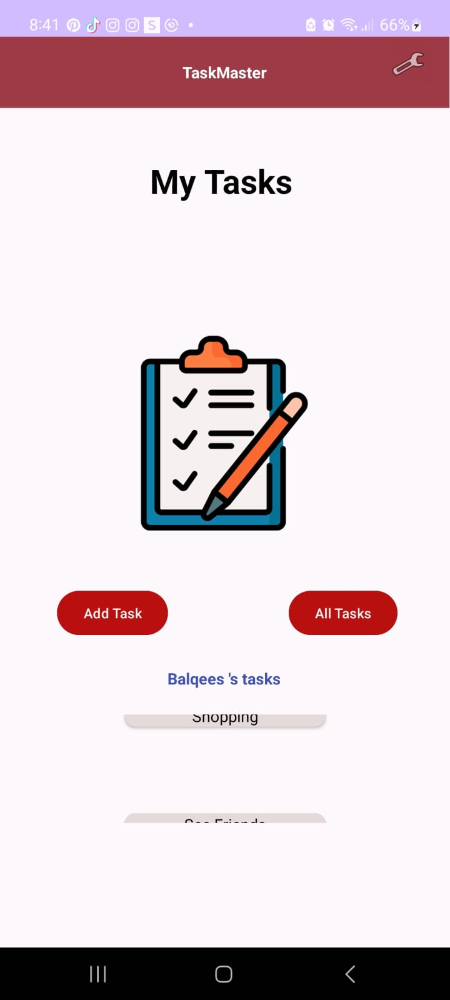
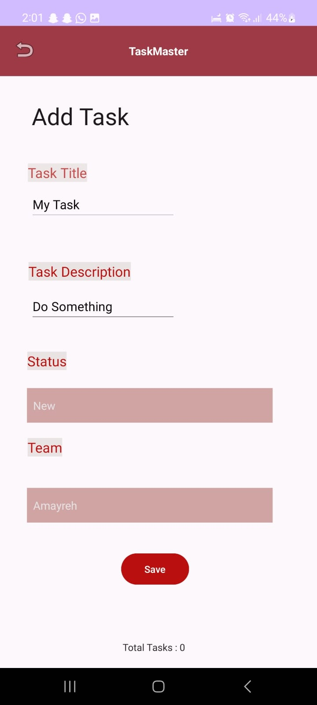
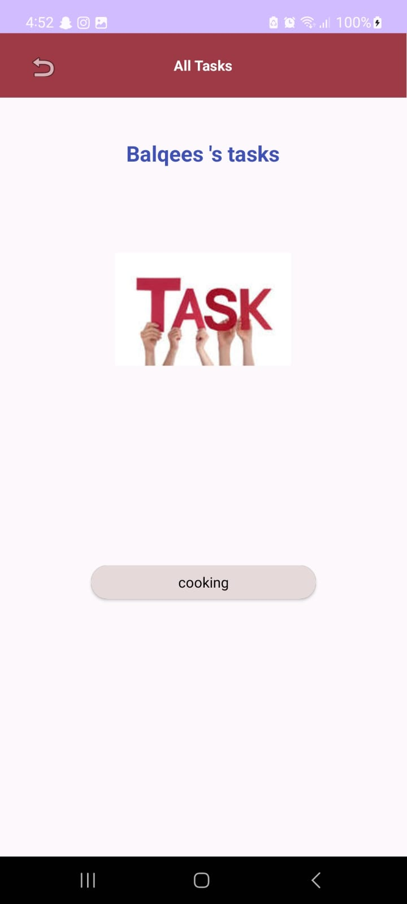
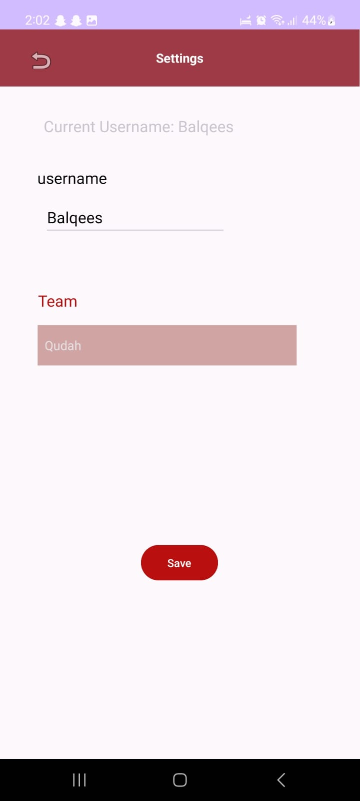
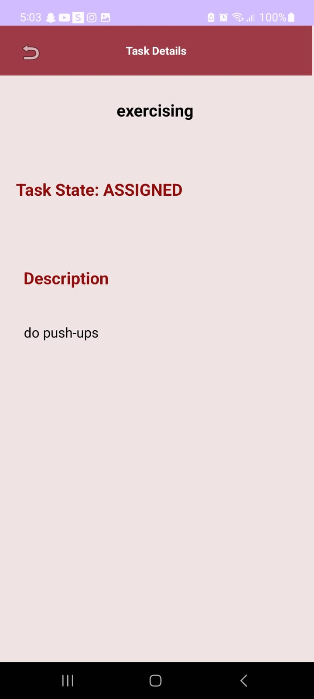
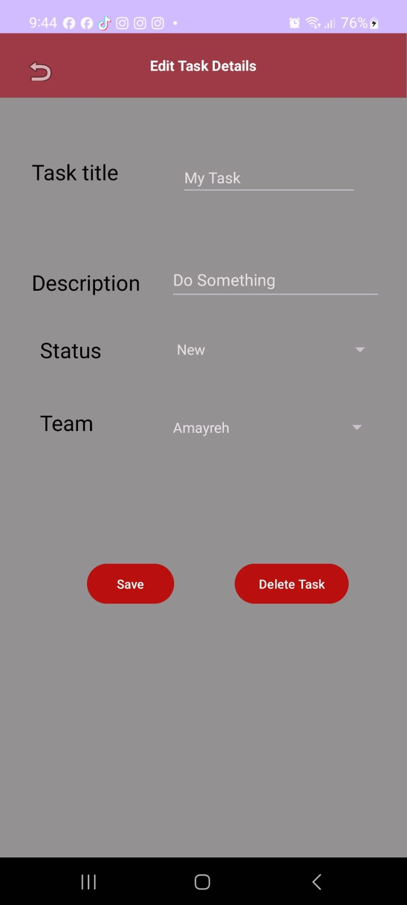

# task_master

In this project, I will integrate AWS Amplify to add scalable backend functionality to our 
Taskmaster app. AWS Amplify provides a convenient way to interact with cloud services, and we'll 
be using it to store and manage tasks in DynamoDB.

## Prerequisites
- You should already have an AWS account.
- Make sure you have the Amplify CLI installed. If not, install it by following the Amplify Getting
  Started guide.

## Features

- Task Creation: Users can create tasks with titles, descriptions, and assign them to specific teams.
- Team Management: Teams can be created and managed to organize tasks effectively.
- User Settings: Users can set their username and choose a team in the settings.

### Homepage

Refactored homepage RecyclerView to display all Task entities from DynamoDB. Query the tasks 
using Amplify and update your RecyclerView to display the cloud-based tasks.

TaskMaster is built using Android and AWS Amplify. It allows users to create tasks and organize 
them based on teams. The app includes features such as task creation, team management, and 
user settings.

The main page of the application is designed to match the wireframe provided. It includes the
following elements:

- **Heading:** A heading is displayed at the top of the page, providing context for the application.
- **Image Mock:** An image is used to simulate the "My Tasks" view, providing users with a visual 
  representation of their tasks.
- **Navigation Buttons:** At the bottom of the homepage, users are presented with buttons that 
  allow them to navigate to other parts of the application, specifically the "Add Task" and 
  "All Tasks" pages.
- **User Tasks Buttons:** At the bottom of the homepage, users are presented with buttons that
  allow them to navigate to their tasks that will takes them into details of the task they press on.
- **Image Button of Settings:** At the top right corner an icon added to represent settings page.  
- **Recycler View:** To display a list of tasks. I've included hardcoded Task data to demonstrate 
  this feature.

### Add a Task

Modified Add Task form to save the data entered as a Task to DynamoDB. Used Amplify's data 
management functions to create and save tasks.
Allows users to input details about a new task, including a title and a body. Key features 
of this page are as follows:

- **Title and Body Input:** Users can enter a task title and a description in text fields 
  provided on the page.
- **Spinner Task State:** User can choose the state of the task that will be saved. 
- **Save Task:** When the user clicks the "Save" button, a "Your Task was saved" label is
displayed on the page to confirm that the task has been successfully saved.

### All Tasks

The "All Tasks" page is a simple view consisting of an image and a back button. This page serves 
the purpose of displaying all tasks based on user team without additional functionality. Users can
return to the previous page using the back button.

### Settings 

The Settings page in the TaskMaster app allows users to customize their app experience by 
setting their username, and their team name Here's what users can do on the Settings page:
- Set their Username
- View their Current Username
- Choose their Team
- Snackbar Feedback: After successfully saving their username, they'll receive feedback in the  
  form of a Snackbar message confirming that your username has been saved.

### RecyclerView

Created five hardcoded `Task` instances and used them to populate the `RecyclerView` 
through the `ViewAdapter`. This not only showcases the functionality but also serves as a 
starting point for displaying real task data.

### Task Details 

The Task Detail page within the TaskMaster app provides detailed information about specific tasks.
Here's what users can do on the Task Detail page:

- View Task Title
- View Task Description: Below the task title, they can read a detailed description of the 
  selected task. 

### Edit Task

This Activity shows the Task Details, that user pressed on, and can update it any/ all of it's 
details, or delete it. 

