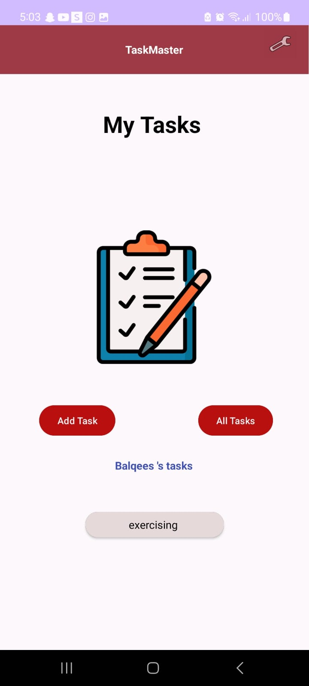
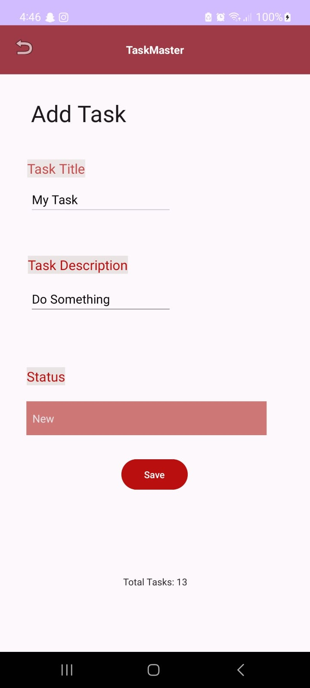
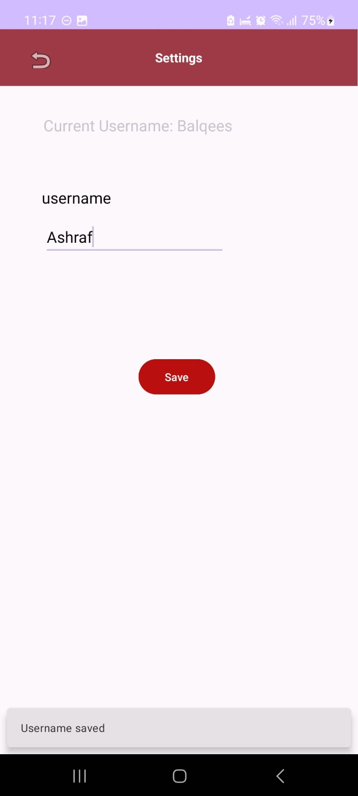

# task_master

## Features

### Homepage

The main page of the application is designed to match the wireframe provided. It includes the
following elements:

- **Heading:** A heading is displayed at the top of the page, providing context for the application.
- **Image Mock:** An image is used to simulate the "My Tasks" view, providing users with a visual 
  representation of their tasks.
- **Navigation Buttons:** At the bottom of the homepage, users are presented with buttons that 
  allow them to navigate to other parts of the application, specifically the "Add Task" and 
  "All Tasks" pages.
- **User Tasks Buttons:** At the bottom of the homepage, users are presented with buttons that
  allow them to navigate to their tasks that will takes them into details of the task they press on.
- **Image Button of Settings:** At the top right corner an icon added to represent settings page.  
- **Recycler View:** To display a list of tasks. I've included hardcoded Task data to demonstrate 
  this feature.

### Task Model and Room
Room is a local database solution that helps us persist data in our Android application. I've
integrated Room into the TaskMaster app to manage tasks efficiently.I did this by following these
steps:
- Setting up Room following the Android documentation and from the class 29 notes.
- Modifying the `Task` class to be an Entity, meaning it will be stored in the local database.
- User can Add a task and store it in the local database.
- Displays a list of tasks using a RecyclerView. This RecyclerView is populated with all `Task`
  entities stored in the local database.

### Add a Task

Allows users to input details about a new task, including a title and a body. Key features 
of this page are as follows:

- **Title and Body Input:** Users can enter a task title and a description in text fields 
  provided on the page.
- **Spinner Task State:** User can choose the state of the task that will be saved. 
- **Save Task:** When the user clicks the "Save" button, a "Your Task was saved" label is
displayed on the page to confirm that the task has been successfully saved.

### All Tasks

The "All Tasks" page is a simple view consisting of an image and a back button. This page serves 
the purpose of displaying all tasks without additional functionality. Users can return to the 
previous page using the back button.

### Settings 

The Settings page in the TaskMaster app allows users to customize their app experience by 
setting their username, Here's what users can do on the Settings page:
- Set their Username
- View their Current Username
- Snackbar Feedback: After successfully saving their username, they'll receive feedback in the  
  form of a Snackbar message confirming that your username has been saved.

### RecyclerView

Created five hardcoded `Task` instances and used them to populate the `RecyclerView` 
through the `ViewAdapter`. This not only showcases the functionality but also serves as a 
starting point for displaying real task data.

### Task Details 

The Task Detail page within the TaskMaster app provides detailed information about specific tasks.
Here's what users can do on the Task Detail page:

- View Task Title
- View Task Description: Below the task title, they can read a detailed description of the 
  selected task. 

