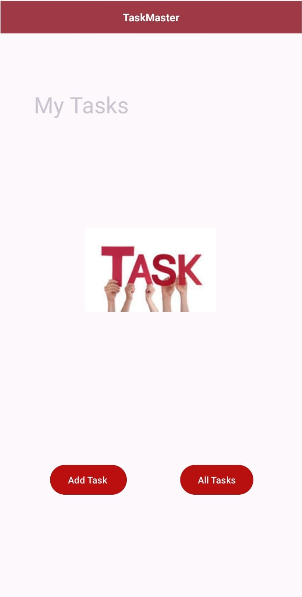
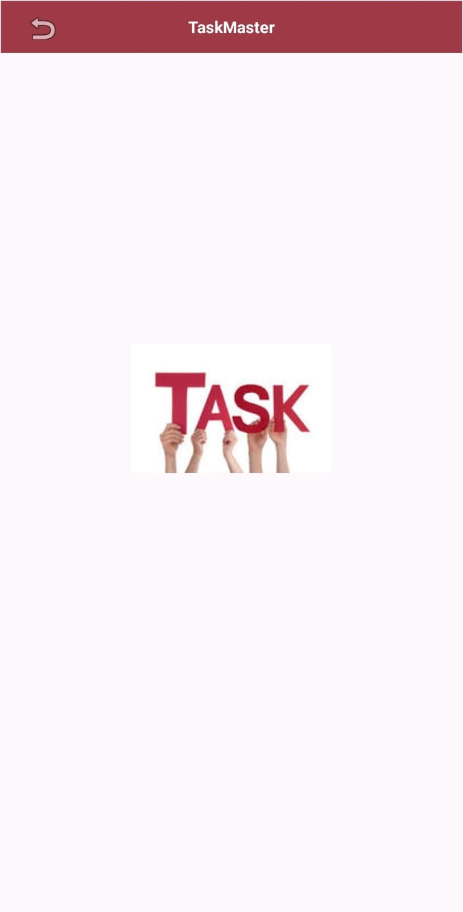

# task_master

### Homepage

The main page of the application is designed to match the wireframe provided. It includes the
following elements:

- **Heading:** A heading is displayed at the top of the page, providing context for the application.
- **Image Mock:** An image is used to simulate the "My Tasks" view, providing users with a visual 
  representation of their tasks.
- **Navigation Buttons:** At the bottom of the homepage, users are presented with buttons that 
  allow them to navigate to other parts of the application, specifically the "Add Task" and 
  "All Tasks" pages.

### Add a Task

Allows users to input details about a new task, including a title and a body. Key features 
of this page are as follows:

- **Title and Body Input:** Users can enter a task title and a description in text fields 
  provided on the page.
- **Submission:** When the user clicks the "Submit" button, a "submitted!" label is displayed on 
  the page to confirm that the task has been successfully added.

### All Tasks

The "All Tasks" page is a simple view consisting of an image and a back button. This page serves 
the purpose of displaying all tasks without additional functionality. Users can return to the 
previous page using the back button.

